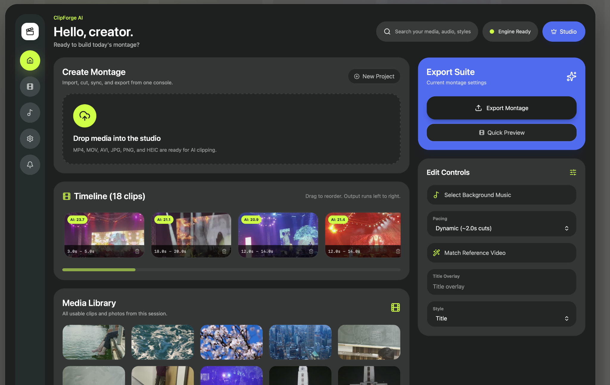

# ClipForge AI

<p align="center">
  
</p>

ClipForge AI is a desktop-first AI montage editor built for creators who want to turn raw footage into structured edits faster.

Instead of manually sorting clips and assembling timelines, ClipForge helps organize media, generate edit flows, match references, and streamline montage creation from a single interface.

## What it does

- Import media into a local editing workspace
- Organize clips inside a visual timeline
- Match reference videos for editing style
- Configure pacing and montage behavior
- Select background music
- Preview and export edits

## Stack

**Frontend**
- React
- TypeScript
- TailwindCSS

**Desktop**
- Tauri (Rust-powered desktop runtime)

**Processing**
- Python engine for media / AI workflows

## Why Tauri?

ClipForge deals with local media processing and desktop-level file access.

Tauri was chosen over Electron because of:
- Smaller bundle size
- Better memory efficiency
- Native desktop performance
- Rust backend support

## Running locally

Clone the repo:

```bash
git clone https://github.com/yourusername/clipforge-ai.git
cd clipforge-ai
```

Install dependencies:

```bash
npm install
```

Run the frontend:

```bash
npm run dev
```

Run the desktop app:

```bash
npm run tauri dev
```

## Project Structure

```txt
src/                → React frontend
src-tauri/          → Tauri backend (Rust)
python-engine/      → AI/media processing
public/             → Static assets
```

## Current Status

Still actively being built. Focus areas right now:

- Better montage generation
- Smarter clip ranking
- Improved export pipeline
- AI-assisted editing workflows
